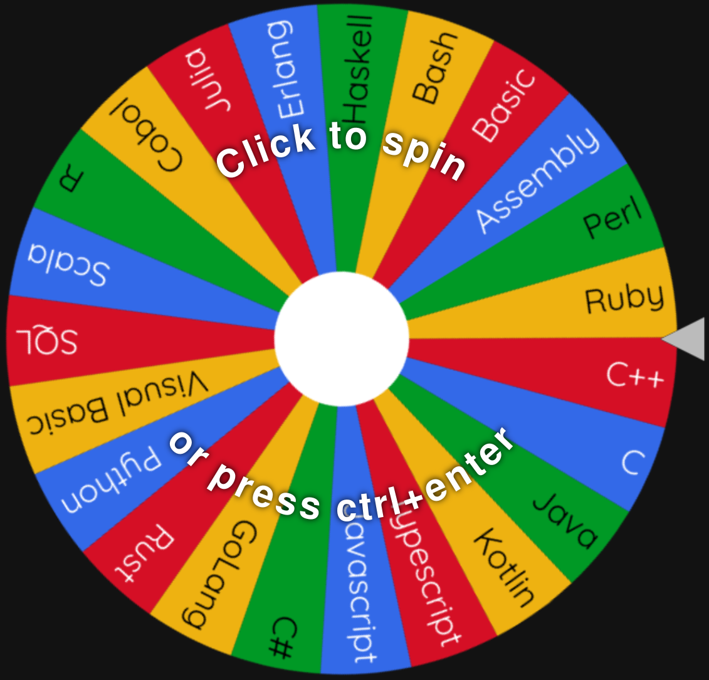

    
    <h1 align="center">Advent of Code 2022</h1>

Picking random language to use each day (removing as I go).
As I get harder languages and further in I may go back to earlier days to free up an easier language.

[Site used for the wheel](https://wheelofnames.com/)

    
Language list

    <ul>
        <li> Assembly </li>
        <li> Bash - Day 6 </li>
        <li> Basic </li>
        <li> C - Day 5 </li>
        <li> C# </li>
        <li> C++ - Day 8 </li>
        <li> Cobol - Day 2</li>
        <li> Common Lisp </li>
        <li> Erlang </li>
        <li> GoLang - Day 7 </li>
        <li> Haskell- Day 10 </li>
        <li> Julia </li>
        <li> Kotlin </li>
        <li> Lua - Day 3 </li>
        <li> Pascal - Day 9 </li>
        <li> Perl </li>
        <li> Python </li>
        <li> Ruby </li>
        <li> Rust - Day 1 </li>
        <li> SQL </li>
        <li> Scala </li>
        <li> Typescript </li>
        <li> V </li>
        <li> Visual Basic </li>
        <li> Zig - Day 4 </li>
    </ul>

